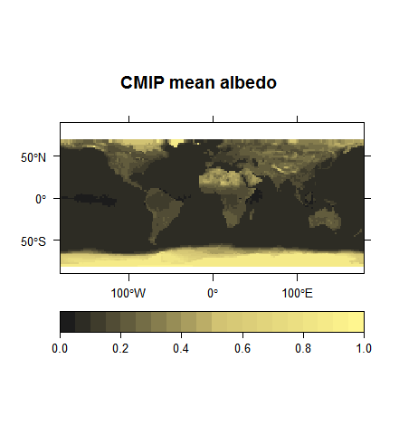
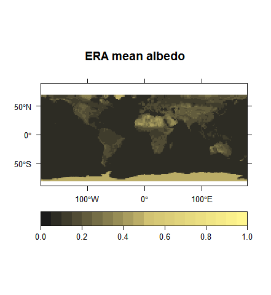
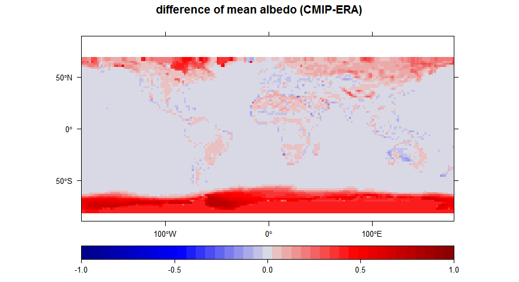
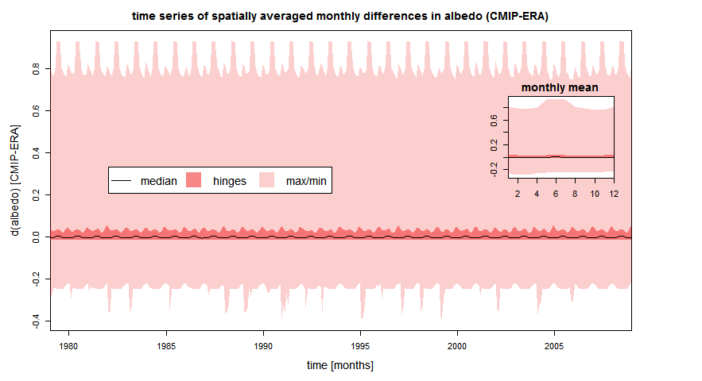
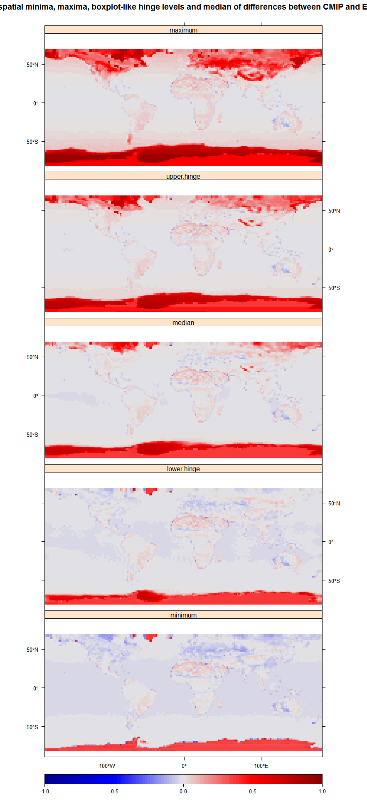
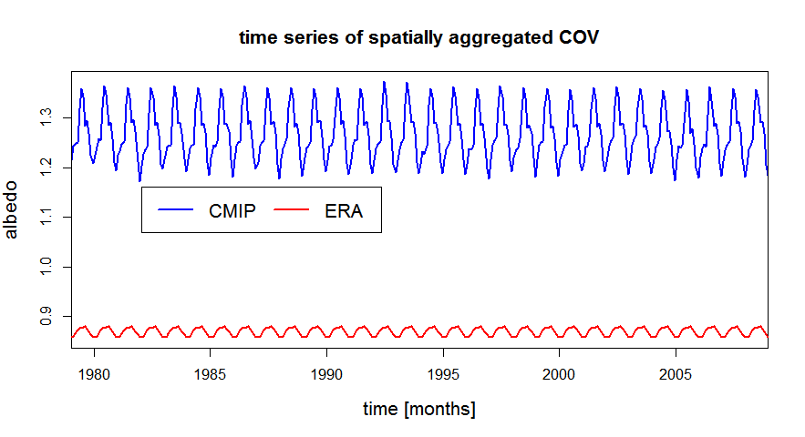
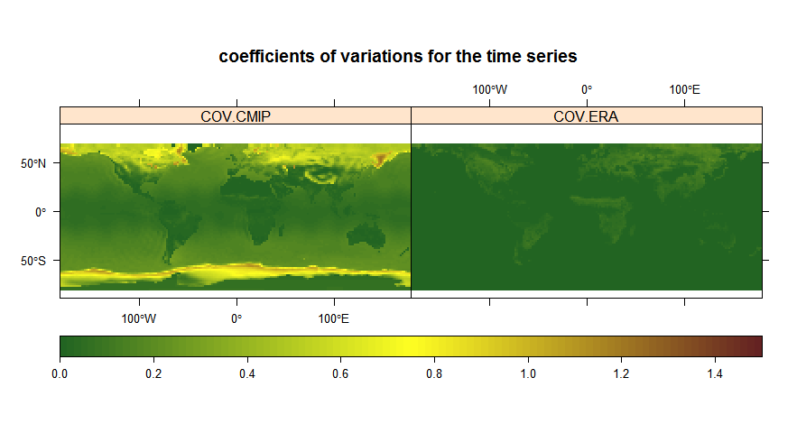

# Monthly albedo comparison of CMIP and ERA datasets
Ben Müller  
8. Oktober 2015  

## Analysis

### Basic calculations for CMIP and ERA-Interim data

Setting the operating directories for CMIP and ERA-interim data ...


```r
##### Operating directories #####

WD.CMIP = "MPI-M.CMIP5.AMIP\\Amon\\r3i1p1"

WD.ERA = "ERA-Interim"
```

and run *source('Main.R')* will start the preprocessing, including:

* loading monthly CMIP data for upwelling and downwelling short wave data,
* calculating albedo from the ratio of shortwave data,
* if necessary, aggregating daily ERA-Interim albedo data at 12:00 am to monthly data,
* loading monthly ERA-Interim albedo data,
* adjusting the resolution of the finer ERA-Interim data to the coarser CMIP data,
* masking data that is NA in one of the datasets, and
* wraping data to center the maps on the Atlantic ocean.


```
Get CMIP: 
Time difference of 10.19002 secs

Get ERA: 
Time difference of 0.09201002 secs

Adjust resolution: 
Time difference of 20.54906 secs

Mask data: 
Time difference of 2.145215 secs

Wrap data: 
Time difference of 14.71347 secs

Do all: 
Time difference of 48.28183 secs
```
  
***
  
### Overview on the datasets and their differences

  


  
***

### Spatially aggregated differences analysis in the time series of CMIP and ERA


  
The time steps are aggregated in spatial means of differences and boxplot-like calculations lead to the determination of the hinges.
  
***

### Temporally differences between CMIP and ERA as maps of boxplot-like occurence


    
Mapped boxplot-like calculations of pixel-wise time series data of differences between CMIP and ERA.
  
***
  
### Coefficient of variation (COV) for CMIP and ERA
  
#### Time series of spatial COV


    
#### Maps of temporal COV


  
***
  
### Spatial aggregated temporal differences between CMIP and ERA 
  
#### By continent


```r
# cut differences by continents

DF=data.frame(region=cont$REGION)
```


#### By latitude


