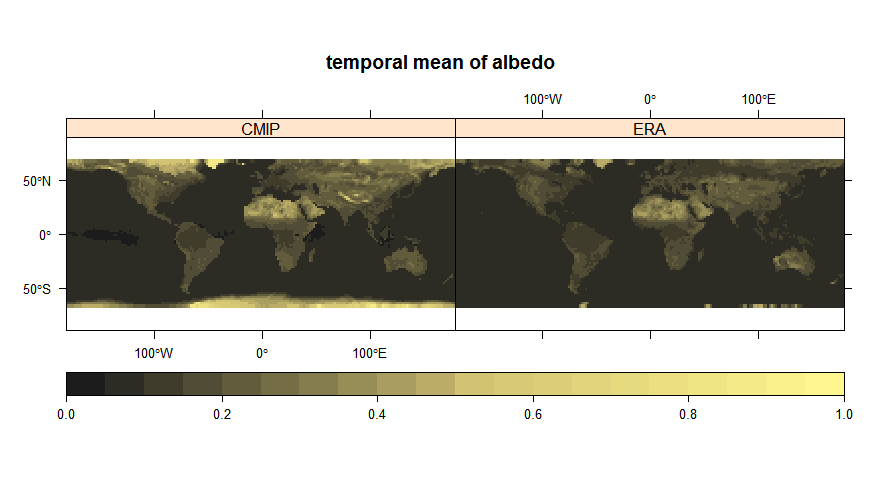

# Monthly albedo comparison of CMIP and ERA datasets
Ben Müller  

## Analysis

### Basic calculations for CMIP and ERA-Interim data

* CMIP and ERA-Interim files are expected as NETCD-files ("*.nc") in the code directories.

* CMIP data is expected to be available as two files: **"rsus"** for upwelling short wave radiation and **"rsds"** for downwelling short wave radiation.

* ERA-Interim is either daily values or aggregated monthly values. If there is only one file, it is assumed to be daily and aggregation is initiated. The monthly data is supposed to be marked with **"agg"**.

* Cygwin and installed CDO is needed for aggregation of ERA-Interim files!

Setting the operating directories for CMIP and ERA-interim data and the path to cygwin ...


```r
##### Operating directories #####

WD.CMIP = "MPI-M.CMIP5.AMIP\\Amon\\r2i1p1"

WD.ERA = "ERA-Interim"
# on the repository, only the aggregated file is saved due to space issues

cygwin = "S:\\cygwincdo\\bin\\bash.exe"
```

and run *source('Main.R')* will start the preprocessing, including:

* loading monthly CMIP data for upwelling and downwelling short wave data,
* calculating albedo from the ratio of shortwave data,
* if necessary, aggregating daily ERA-Interim albedo data at 12:00 am to monthly data,
* loading monthly ERA-Interim albedo data,
* adjusting the resolution of the finer ERA-Interim data to the coarser CMIP data,
* masking data that is NA in one of the datasets, and
* wraping data to center the maps on the Atlantic ocean.


```
Get CMIP: 
Time difference of 9.077723 secs

Get ERA: 
Time difference of 0.09202695 secs

Adjust resolution: 
Time difference of 19.3228 secs

Mask data: 
Time difference of 2.39972 secs

Wrap data: 
Time difference of 15.09153 secs

Do all: 
Time difference of 46.55796 secs
```
  
***
  
### Overview on the datasets ...

 
  
### ... and their differences


  
  
  
  
***

### Spatially aggregated differences analysis in the time series of CMIP and ERA


  
The time steps are aggregated in spatial means of differences and boxplot-like calculations lead to the determination of the hinges.
  
***

### Temporally differences between CMIP and ERA as maps of boxplot-like occurence


    
Mapped boxplot-like calculations of pixel-wise time series data of differences between CMIP and ERA.
  
***
  
### Spatially aggregated temporal differences between CMIP and ERA ...
  
#### ... by continent


#### ... by latitude


  
***
  
### Coefficient of variation (COV) for CMIP and ERA

The coefficient of variation is calculated as: $\sigma \over \mu$
  
#### Time series of spatial COV


    
#### Maps of temporal COV


